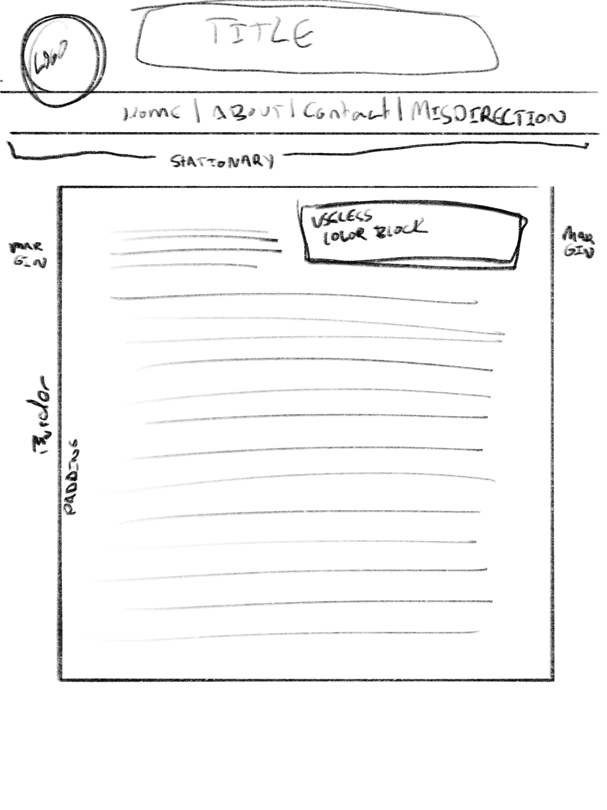

1. What is the difference between padding, margin, and borders?
  Padding is used to
2. Embed the image of your sketch.
  
3. Free Response: Summarize your work cycle for this assignment.
  I spent all day reading the material.
